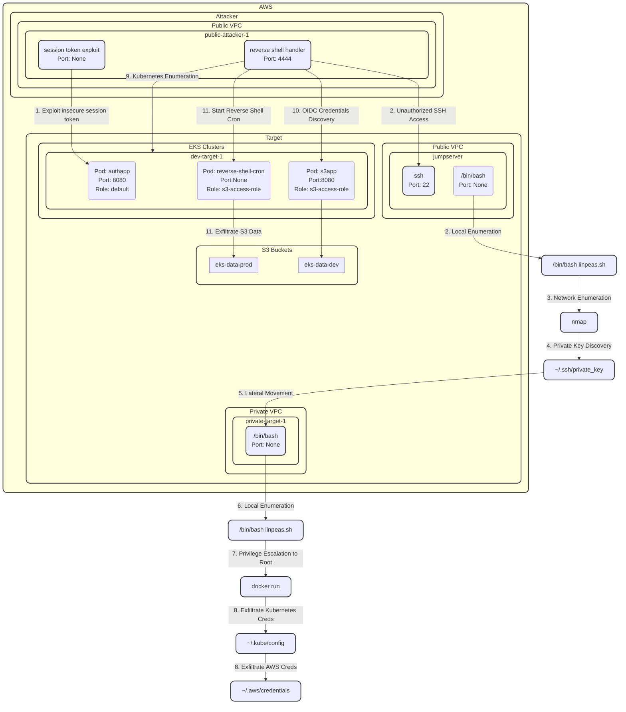

# aws-lacework-composite-ciem-eks

## Description

This scenario covers the compromise of an enternally facing host, leading to unauthorized access to a kubernetes cluster and subsequent data exfiltration from a production s3 bucket.

At a high-level:

* A web server with improper session token security is exposed to the internet
* Attackers brute force the session key and forge a token that provides admin access to the web service
* The admin session allows attackers to gain access to usernames and passwords stored in environment variables
* The password discovered for admin is used to gain access to an internet exposed jump server via ssh
* From the compromised host attackers enumerate the local system and complete a network scan. 
* The local scan reveals an ssh private key and the network scan reveals an internal kubernetes management server
* Attacker use the private key to gain user-level access to the kubernetes management server
* Attackers then escalate privilege to root using docker
* As the root user the attackers discover kubernetes `~/.kube/config` and `~/.aws/credentials`
* The kubernetes config and credentials are exfiltrated to the attackers server
* Attackers, from their host, use the tor network to enumerate both kubernetes and the aws cloud environment
* During the enumeration of the kubenetes cluster attacker discover the `s3app` pod which is using OIDC to assume a role `eks-s3-dev-role`
* Attackers leverage the limited permissions they have to the kubernetes cluster to start a cronjob where they establish a reverse shell in a pod using the `eks-s3-dev-role`
* Inside the compromised pod attackers once again enumerate their access to discover they have access to two s3 buckets `eks-data-dev` and `eks-data-prod` due to a misconfigured role policy `arn:aws:s3:::eks-data-*`
* From inside the compromised pod attacker exfiltrate `production.db`

## Diagram

## Walkthrough

Alright, we’re going to walk you through a demo and storyline that we documented as part of actual **attack scenarios** we’ve observed in **our customers' environments**. The demo itself outlines a compromise scenario demonstrating why CSPM itself isn’t enough and that you need both threat and risk context from your CNAPP to effectively secure your cloud environment. 

You’ll see some of the innovations released in the last year including:

* **composite alerts**
* **CIEM**
* **alert context panels**
* **attack path analysis** and **security graph**
* **kubernetes audit logs monitoring**

We’ve got a lot to cover, let’s get started.

In our scenario, we have a fictitious company, Interlace Labs. Interlace Labs recently brought onboard a new developer who, as part of his onboarding tasks was asked to clone a template application and deploy to the development EKS cluster. He was also provided with the DNS name for the _legacy_ jumpserver the provides access to and internal kubernetes management server for the development the EKS cluster.

However, a few hours later, the security team at Interlace Labs receives multiple high and critical event notifications from Lacework, indicating suspicious activity within their cloud account. We can see these here in the Alerts Dashboard.